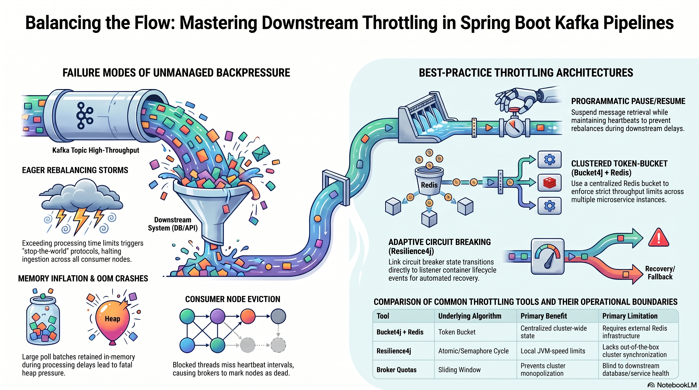

# Throttling in Data Pipelines

Resilience4j and Bucket4j are critical tools for building resilient Spring Boot applications, especially when integrating with high-throughput systems like Apache Kafka.



## Technical Report: Resilient Kafka Pipeline Architecture and Risk Assessment

### 1. Problem Statement: Downstream Throttling and Failure Modes

Our streaming applications face significant reliability risks when downstream processing capabilities (relational databases and external APIs) cannot scale to meet inbound Kafka traffic surges. Unmanaged surges trigger a cascading sequence of failure states:

- **Increasing Consumer Lag**: Processing capacity falls behind the log-end offset, causing delays in business-critical transactions.
- **Heap Memory Pressure**: Large poll batches are retained in-memory during slow processing, leading to high Garbage Collection pauses and potential Out-Of-Memory (OOM) crashes.
- **Eager Rebalancing Storms**: If individual message processing times exceed the `max.poll.interval.ms` threshold, the broker evicts the consumer and triggers a "stop-the-world" rebalance across the entire group.
- **Consumer Node Eviction**: Blocked main threads miss heartbeat intervals, causing the coordinator to mark the node as dead.

Static configuration properties like `max.poll.records` or `idleBetweenPolls` are insufficient as they permanently throttle consumption even when downstream services are healthy.

### 2. Comparative Analysis of Resilience Tools

Achieving adaptive traffic shaping requires a synergy of distributed rate limiting and local fault isolation.

| Feature           | Bucket4j (with Redis)                                        | Resilience4j RateLimiter                             | Resilience4j Circuit Breaker                                |
| :---------------- | :----------------------------------------------------------- | :--------------------------------------------------- | :---------------------------------------------------------- |
| **Primary Goal**  | Clustered Throughput Control                                 | Local Node Throughput                                | Fault Detection & Isolation                                 |
| **State Storage** | Centralized Redis                                            | Local JVM Memory                                     | Local JVM Memory                                            |
| **Pros**          | Scalable across instances; strictly enforces cluster limits. | Lock-free; zero external dependencies; low overhead. | Prevents cascading failures by failing fast during outages. |
| **Cons**          | Requires external infrastructure (Redis).                    | Lacks out-of-the-box cluster synchronization.        | Requires careful threshold tuning to avoid false trips.     |

### 3. Implementation Strategy: Adaptive Throttling

A robust implementation leverages Spring Kafka’s programmatic APIs to manage the consumer lifecycle dynamically.

#### Phase 1: Distributed Rate Limiting (Bucket4j + Redis)

To implement Phase 1 (Adaptive Rate Limiting with Bucket4j + Redis), you must integrate a centralized token bucket state with the Spring Kafka listener container lifecycle to provide clustered throughput control.

**Core Implementation Steps**

- **Distributed State Management**: Use a Redis-backed `ProxyManager` to share the "leaky bucket" state across all application instances. This ensures that the collective traffic from all nodes does not exceed the downstream service's capacity.
- **Atomic Metering and Interruption**: For each message received, the service performs an atomic check against the Redis bucket. If the rate limit is reached, the service receives a refusal and the Time-To-Live (TTL) until the next token is available.
- **Non-Blocking Suspension**: Instead of sleep-blocking the thread, the service calls `container.pause()`. This is critical because the main consumer thread continues heartbeat polling, which prevents eager rebalancing storms and consumer node eviction.
- **Automated Recovery**: Using the TTL provided by Redis, the service schedules a background task to call `container.resume()`, allowing ingestion to restart exactly when capacity is restored.

**Pseudo Java Implementation for Spring Boot**
The following pseudo-code demonstrates how to link Bucket4j results to Spring Kafka container controls.

**1. Redis Configuration for Bucket4j**

```java
@Configuration
public class RateLimitConfig {
    @Bean
    public ProxyManager<String> proxyManager(LettuceConnectionFactory connectionFactory) {
        // Configure Bucket4j to use Redis (Lettuce or Jedis) for distributed state
        return LettuceProxyManager.builder(connectionFactory).build();
    }
}
```

**2. Adaptive Kafka Listener Logic**

```java
@Component
public class AdaptivePaymentListener {

    @Autowired
    private ProxyManager<String> proxyManager;

    @Autowired
    private KafkaListenerEndpointRegistry registry;

    @Autowired
    private TaskScheduler taskScheduler;

    @KafkaListener(id = "payment-consumer", topics = "payments", ackMode = "MANUAL")
    public void onMessage(ConsumerRecord<String, String> record, Acknowledgment ack) {

        // Step 1: Atomic Metering via Redis
        BucketConfiguration config = BucketConfiguration.builder()
                .addLimit(Bandwidth.simple(100, Duration.ofMinutes(1))) // 100 payments/min
                .build();
        Bucket bucket = proxyManager.builder().build("downstream-api-limit", config);

        ConsumptionProbe probe = bucket.tryConsumeAndReturnRemaining(1);

        if (probe.isConsumed()) {
            // Step 2: Process normally if tokens are available
            processPayment(record.value());
            ack.acknowledge(); // Commit offset only after successful processing [4]
        } else {
            // Step 3: Batch Interruption & Consumer Suspension
            long waitTimeMillis = probe.getNanosToWaitForRefill() / 1_000_000;

            MessageListenerContainer container = registry.getListenerContainer("payment-consumer");

            // Programmatically pause to prevent rebalances while waiting [2]
            container.pause();

            // Step 4: Scheduled Recovery using TTL [2]
            taskScheduler.schedule(() -> {
                container.resume();
            }, Instant.now().plusMillis(waitTimeMillis));

            // Do NOT acknowledge the message; it will be re-polled upon resume
        }
    }
}
```

**Critical Implementation "Watch-Outs"**

- **Thread Safety**: Use the native `pause()` and `resume()` methods provided by the `MessageListenerContainer` (available since Spring Kafka 2.1.3), as they are explicitly designed for thread-safe execution across the application and consumer threads.
- **Manual Offset Management**: You must set `enable.auto.commit` to `false` and use `AckMode.MANUAL`. The offset should only be committed after the message has successfully completed all processing steps to avoid data loss during a pause.
- **Infrastructure Fallback**: If the Redis instance fails, the system may lose cluster-wide coordination. Configure a fallback to local in-memory rate limiting within the code to ensure the pipeline doesn't halt entirely during a Redis outage.

#### Phase 2: Fault Isolation (Resilience4j Circuit Breaker)

- **Transition Binding**: The application listens for Circuit Breaker state changes.
- **Open State Handling**: When the circuit trips to `OPEN`, the Kafka container is programmatically paused to prevent hammering failing dependencies.
- **Self-Healing**: In the `HALF_OPEN` state, the container is resumed to verify downstream recovery.

#### Phase 3: Asynchronous Optimization

- **Async Offloading**: Heavy business logic is moved to an `AsyncListenableTaskExecutor` to prevent blocking the poll thread.
- **Partition-Level Control**: Use `pausePartition()` to selectively throttle impacted data streams while keeping healthy partitions active.
  Implementing Phase 3: Asynchronous Performance Optimization involves offloading heavy processing tasks to a separate thread pool while maintaining the health of the Kafka consumer session
  . This phase is critical for preventing Eager Rebalancing Storms and Consumer Node Eviction caused by blocked main threads
  .
  Based on the sources, here is how you implement Phase 3:

1.  Offload to an Async Task Executor
    Instead of processing business logic (like database writes or downstream API calls) directly inside the @KafkaListener method, you hand the payload to an Async Task Executor
    .
    Why: This allows the main Kafka consumer thread to remain unblocked
    .
    Heartbeat Maintenance: While the background thread is busy, the main thread continues to invoke the poll() loop
    . These polls will return empty batches, but they satisfy the broker's requirement for active communication, keeping the consumer "alive" in the group
    .
2.  Implement Partition-Level Control
    Rather than pausing the entire consumer container, you can use selective throttling
    .
    Feature: Starting with Spring Kafka 2.7, you can use the pausePartition() and resumePartition() methods
    .
    Precision: This allows you to stop ingestion only for the specific topic-partition being processed by the async task while allowing the consumer to potentially continue work on other active partitions
    .
3.  Ensure Manual Offset Management
    When moving to asynchronous processing, you must move away from automatic commits
    .
    Configuration: Set enable.auto.commit to false and use AckMode.MANUAL
    .
    Execution: The offset should only be committed after the asynchronous task has successfully completed all processing steps (e.g., Eligibility check, Database storage, and Downstream publication)
    .
    Pseudo-Code Implementation
    This example demonstrates how to combine an ExecutorService with partition-level pausing.
    @KafkaListener(id = "async-payment-listener", topics = "payments", ackMode = "MANUAL")
    public void onMessage(ConsumerRecord<String, String> record, Acknowledgment ack, Consumer<?, ?> consumer) {

        // 1. Identify the partition to pause
        TopicPartition partition = new TopicPartition(record.topic(), record.partition());

        // 2. Pause ingestion for THIS partition only
        // This allows the main thread to keep polling/sending heartbeats
        consumer.pause(Collections.singleton(partition));

        // 3. Offload heavy logic (e.g., 300 payments) to Async Executor
        taskExecutor.execute(() -> {
            try {
                // Perform eligibility checks, DB writes, and downstream calls
                processComplexPayload(record.value());

                // 4. Manually commit only after full success
                ack.acknowledge();
            } finally {
                // 5. Resume the partition to fetch the next message
                consumer.resume(Collections.singleton(partition));
            }
        });

    }
    Critical Watch-Outs for Phase 3
    Thread Safety: Always use the native pause() and resume() methods provided by Spring Kafka (introduced in version 2.1.3), as they are specifically designed for thread-safe execution across the application and consumer threads
    .
    Heap Pressure: While offloading to async threads prevents blocking, be careful not to trigger Heap Memory Pressure by taking on more tasks than the background threads can process
    .
    Order of Operations: Ensure that any Resilience4j aspects (Retry, Circuit Breaker) are wrapped around the logic inside the async task to ensure failures are handled correctly without crashing the main consumer thread
    .

### 4. Risk Assessment: Redis Infrastructure Outage

If the Redis-backed token bucket infrastructure becomes unavailable, the system faces several critical failure scenarios:

- **Loss of Clustered Coordination**: The service loses its ability to coordinate traffic across multiple instances.
- **Fallback Complexity**: Without Redis, the service may fail-fast or fallback to local in-memory limiting. If local fallback is used, the aggregate traffic from all nodes may overwhelm downstream services.
- **Loss of Resumption Logic**: The automated `resume()` trigger relies on the TTL data returned by Redis. Without this data, the service may remain paused indefinitely or resume too early, causing immediate re-pausing.

**Recommendation**: Configure the `ProxyManager` to handle Redis connection failures by defaulting to a conservative local rate limit to prevent a total pipeline halt.

### 5. Implementation Watch-outs

- **Aspect Ordering**: Resilience4j aspects must follow the hierarchy: `Retry` → `CircuitBreaker` → `RateLimiter`.
- **Thread Safety**: Use native `pause()` and `resume()` methods introduced in Spring Kafka 2.1.3 for thread-safe container management.
- **Manual Offsets**: Set `enable.auto.commit` to `false` and commit offsets only after successful downstream publication to ensure data integrity.
